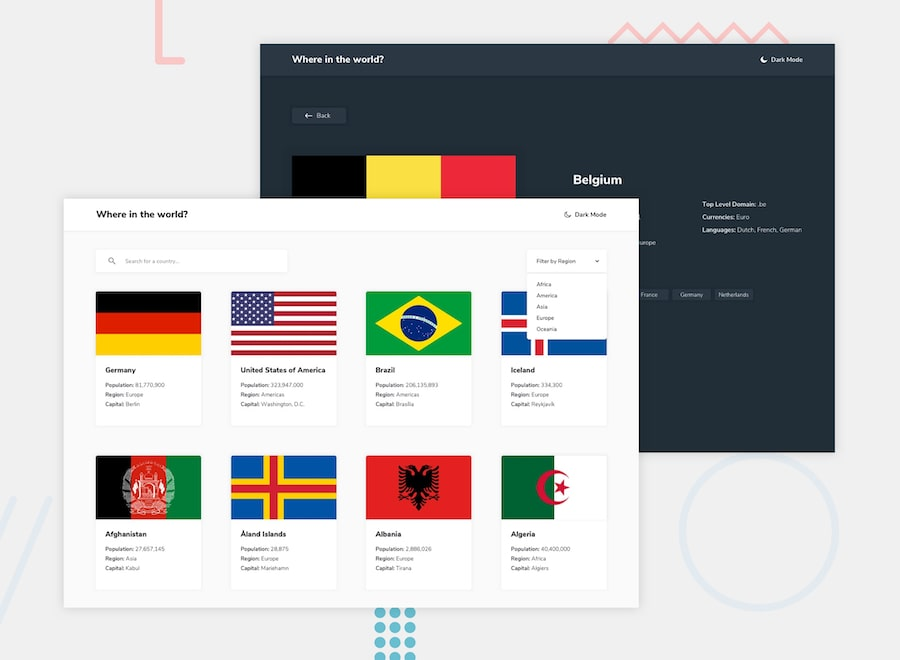

# Where in the world?

A responsive country explorer built with React. Browse countries from around
the world, search by name, filter by region, and open a detailed view with
population, languages, currencies, and neighboring countries.



> The screenshot above is the original design reference. Fresh application
> screenshots will be added after the polished release is deployed.

[View the live application](https://countries-api-by-adrian.vercel.app/)

## Features

- Search countries by name and filter them by region
- Paginated, alphabetically ordered country results
- URL-backed search, region, and page state for refreshable and shareable views
- Detailed country information with direct border-country navigation
- Browser Back navigation that restores filters, pagination, and scroll position
- Persistent light and dark themes with system-preference support
- Responsive layouts for mobile, tablet, and desktop
- Loading skeletons, retryable errors, empty states, and a custom 404 page
- Subtle interface animations with reduced-motion support

## Accessibility

Accessibility is treated as part of the application architecture rather than a
separate visual layer. The interface includes:

- Semantic headings, lists, forms, and named landmarks
- A skip link and managed focus after route navigation
- Visible keyboard focus indicators
- Accessible names and states for controls and pagination
- Live announcements for result counts and empty states
- Meaningful flag alternative text
- Motion that respects `prefers-reduced-motion`
- Mobile reflow without horizontal scrolling at a 320px viewport

## Performance

- Route-level code splitting for Home, Country Details, and the 404 page
- An in-memory country cache with concurrent-request deduplication
- Prioritized above-the-fold flags and lazy loading for later images
- Asynchronous image decoding and preconnections to external origins
- Lightweight inline SVG icons instead of a runtime icon library
- Memoized filtering and pagination calculations

## Technology

- [React 19](https://react.dev/)
- [React Router 6](https://reactrouter.com/)
- [Vite 8](https://vite.dev/)
- [Tailwind CSS 4](https://tailwindcss.com/)
- [countries.dev API](https://countries.dev/)

## Architecture

```text
src/
├── api/          API requests and response normalization
├── components/   Country, layout, and reusable UI components
├── context/      Application-wide theme state
├── hooks/        Data, filtering, pagination, and document-title logic
├── pages/        Route-level screens and error states
└── routes/       Lazy route configuration
```

The API layer normalizes external data into a stable application model before
it reaches the UI. Page components coordinate state and hooks, while reusable
components remain focused on presentation and interaction. Search, region, and
pagination values live in the URL so navigation behavior does not depend on
temporary component state.

## Getting started

### Requirements

- Node.js 20.19+ or 22.12+
- npm

### Installation

```bash
git clone https://github.com/adriannasrat/countries.git
cd countries
npm install
```

Start the development server:

```bash
npm run dev
```

Vite will print the local development URL in the terminal.

## Available scripts

| Command | Purpose |
| --- | --- |
| `npm run dev` | Start the Vite development server |
| `npm run build` | Create an optimized production build |
| `npm run preview` | Preview the production build locally |

## Data source

Country data is requested from the [countries.dev API](https://countries.dev/)
and normalized in the application API layer. Flag images are served from the
URLs provided by the API response.

## Design source

This project began as the Frontend Mentor REST Countries API challenge and was
expanded with pagination, URL-persisted state, robust routing, accessibility,
animations, caching, and performance optimizations.

## Project status

The main application experience is complete. The project includes production
metadata, installable-app metadata, client-side route rewrites, long-lived
asset caching, and baseline security headers for Vercel. The final release
check will verify the deployed configuration, capture fresh screenshots, and
run Lighthouse against the production deployment.
